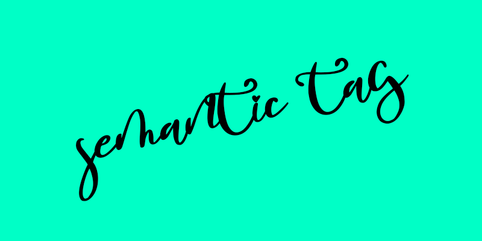
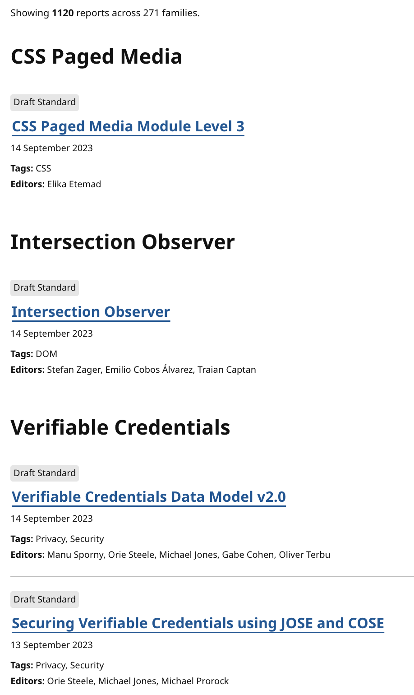

*~~사실 썸네일 이미지는 UX 측면에서 정말 별로라고 생각합니다. 필기체는 이쁘긴 하지만 알아보기 어렵거든요~~*

> *웹 접근성은 사실 검색엔진 최적화와도 관련이 있습니다. 그 덕에 요즘 채용시장에선 웹 접근성과 웹 표준이라는 키워드가 종종 나오기도 하죠. 그럼 한 번 알아봅시다.*
> *by. hoslim*

## 목차
 - 알아볼 것들
 - 웹 표준?
 - 그래서 웹 표준이 뭔데?
 - 웹 접근성과 관련된 html tag
 - semantic tag

### 알아볼 것들

그러니까 이 글은 사실 스터디 과제에 따라 글을 작성하는 것에 가깝습니다. 원래 관심이 없었던 건 아닌데, 계기가 없어 공부하지 못한 것에 가깝죠. 과제에서 요구하는 것은 다음과 같습니다.

1. 웹 표준
2. 웹 접근성과 관련된 html tag
3. semantic tag

사실 웹 접근성과 관련된 html tag는 aria tag나 semantic tag 정도가 아닌가 싶긴 한데, 일단 알아봅시다. *~~(우물한 개구리 같은 발언일 것이라고 생각합니다.)~~*

### 웹 표준?

우선 [웹 발전 연구소](http://www.smartebiz.kr/)에서는 이렇게 정의하고 있습니다.
> 웹 표준이란 브라우저 종류 및 버전에 따른 기능 차이에 대하여 호환이 가능하도록 제시된 표준으로, 다른 기종 혹은 플랫폼에 따라 달리 구현되는 기술을 동일하게 구현함과 동시에 어느 한쪽에 최적화되어 치우치지 않도록 공통요소를 사용하여 웹 페이지를 제작하는 기법을 의미한다. 표준화 단체인 W3C(World Wide Consortium)가 권고한 표준안에 따라 웹사이트를 작성할 때 이용하는 HTML, CSS, JavaScript 등에 대한 규정을 담고 있으며 웹 표준의 궁극적인 목적은 웹사이트에 접속한 사용자가 어떠한 운영체제나 브라우저를 사용하더라도 동일한 결과를 보이게 하는 것이다.

[W3C](https://www.w3.org/)에서는 다음과 같이 정의하고 있습니다.

> Web standards are blueprints –or building blocks– of a consistent and harmonious digitally connected world. They are implemented in browsers, blogs, search engines, and other software that power our experience on the web.
> *웹 표준은 조화롭고 한결같은 디지털로 연결된 세상의 청사진(혹은 구현 요소) 입니다. 이러한 세상은 브라우저들, 블로그들, 검색엔진, 또는 웹 경험을 증가시키는 다른 소프트웨어에 구현되어있습니다.*

그러니까 다시 말해 웹 표준이란 '어떤 웹 브라우저를 사용하던, 어떤 환경(ex. pc나 mobile 등등)에서 구동하건 달리 구현되는 기술을 동일하게 구현함과 동시에, 공통 요소를 사용하여 웹 페이지를 제작하는 기법에 대한 기준'을 뜻하는 것 같습니다. 만약 웹 표준이 없었다면 웹 개발자들은 다음과 같은 웹 브라우저 시장 점유율을 보고 브라우저에 따른 웹페이지를 따로 구현해야 했을 것입니다.

하지만 이는 품이 너무 많이 들것입니다. 간단하게는 웹 개발자들이 어떤 브라우저를 지원할지 고민하는 것도 있겠지만, 이번 스터디의 주제인 웹 접근성 측면에서도 문제가 있겠죠?

그래서 있는 것이 웹 표준입니다. 

### 그래서 웹 표준이 뭔데?

사실 그래서 웹 표준이 뭔데? 싶은 것이 사실입니다. 심지어 W3C 사이트를 가면 냅다 수많은 웹에 대한 표준을 잔뜩 던져줍니다.

그래서 대체 이게 뭔가 싶은데, 슬쩍 읽어보면 정말 다양한 웹 컨텐츠나 기술에 대한 표준이 적혀있습니다. 하지만 사실 우리가 원하는 건 프론트엔드에서 직접적으로 사용할 수 있을 것 같은 기술, 그러니까 html 태그와 관련된 것이거든요. 그나마 제가 생각한 개념과는 위키피디아에서 말하는 개념과 비슷합니다

> 웹 사이트나 웹 페이지가 웹 표준을 준수한다는 것은 일반적으로 올바른 HTML, CSS, 자바스크립트를 사이트나 페이지가 가지고 있다는 것을 뜻한다. HTML은 접근성과 시맨틱 HTML의 가이드라인을 충족해야 한다.
> 
> 웹 표준을 논할 때 일반적으로 다음의 것들이 중요성이 있는 것으로 보인다:
> 
> - HTML, XHTML, SVG, XForms와 같은 마크업 언어의 W3C 권고
> - 스타일시트, 특히 CSS의 W3C 권고
> - 흔히 자바스크립트나 ECMA스크립트로 불리는 Ecma 인터내셔널 표준
> - 문서 객체 모델의 W3C 권고
> 
> 웹 접근성은 일반적으로 W3C의 Web Accessibility Initiative가 출판한 웹 콘텐츠 접근성 가이드라인에 기반을 두고 있다.

### 웹 접근성과 관련된 html tag

aria tag가 아니더라도 다른 tag를 사용하여 웹 접근성을 올릴 수 있습니다. 예를 들어 버튼을 만들 때 div를 사용하겠다고 가정해봅시다. 이런 상황에서 CSS와 JS를 잘 적용시킨다면 버튼처럼 동작하게 만들 수 있겠지만, 스크린 리더나 웹 크롤러 등은 해당 div가 버튼인지 모를 것입니다.

이러한 의미론적 태그를 잘 사용해야 웹 접근성을 높일 수 있으며, 이러한 의미가 담겨있는 태그를 semantic tag라고 칭합니다.

### semantic tag 

...

## 참고 링크

[웹발전 연구소](http://www.smartebiz.kr/new/subpage02_02.html)
[mdn semantic](https://developer.mozilla.org/ko/docs/Glossary/Semantics)
[W3C web standards](https://www.w3.org/standards/)
